# Website Health Check with AWS Lambda

**Automated Website Monitoring Using Serverless Architecture**

This project demonstrates a complete **serverless health monitoring solution** for any website using AWS services. A Lambda function runs every 5 minutes, checks if a specific string exists on the target page, and raises an error if the check fails. CloudWatch tracks the `Errors` metric, triggers an alarm when errors occur, and sends notifications via SNS (ready for email).

It covers Lambda blueprints, EventBridge scheduling, CloudWatch metrics/alarms, SNS, environment variables, and observability.

## Technologies Used
- **AWS Lambda** (Python 3.12 blueprint)
- **Amazon EventBridge** (CloudWatch Events rule)
- **Amazon CloudWatch** (Metrics + Alarms)
- **Amazon SNS** (Notifications)
- **Python** (urllib + string validation)

## Architecture

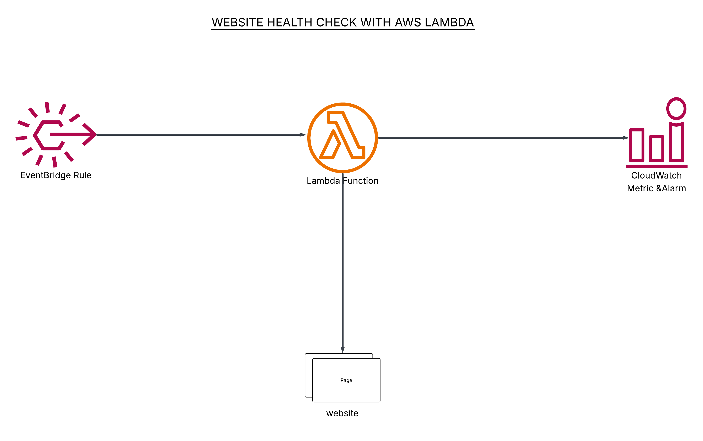

The EventBridge rule triggers the Lambda every 5 minutes → Lambda fetches the website and validates content → On failure it increments the **Errors** metric → CloudWatch Alarm detects > 0 errors and publishes to SNS topic.

## Prerequisites
- AWS account with IAM permissions (Lambda, EventBridge, CloudWatch, SNS)
- Target website URL and a unique string that appears on the page
-  SNS subscription for email notifications

## Step-by-Step Implementation

### 1. Creating the Lambda Function
Started in the AWS Lambda console → **Use a blueprint** → Selected **"Schedule a periodic check of any URL"** → Named the function `WebsiteHealthCheck`.

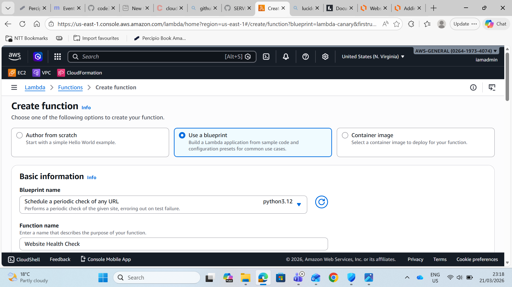

### 2. Blueprint Code (Pre-configured)
AWS provided ready-to-use Python code. It reads `site` and `expected` from environment variables, fetches the page, and checks for the string. If the check fails, the function errors out (triggering the CloudWatch metric).

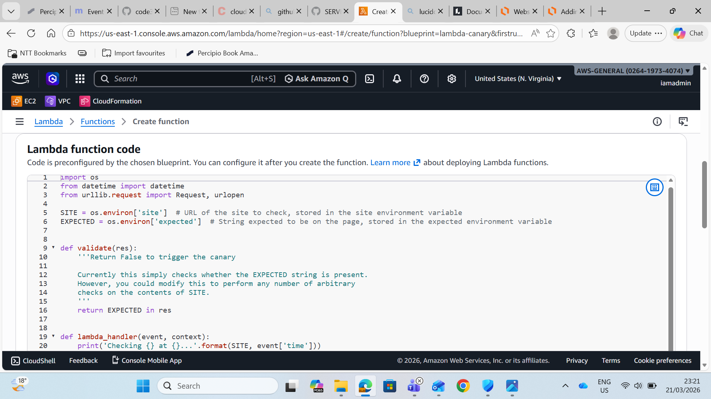

### 3. Adding the EventBridge Trigger
Configured a new EventBridge (CloudWatch Events) rule to invoke the Lambda on a schedule.

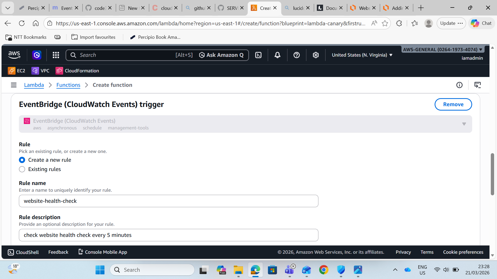

### 4. Schedule Expression
Set to run every 5 minutes using the rate expression `rate(5 minutes)`.

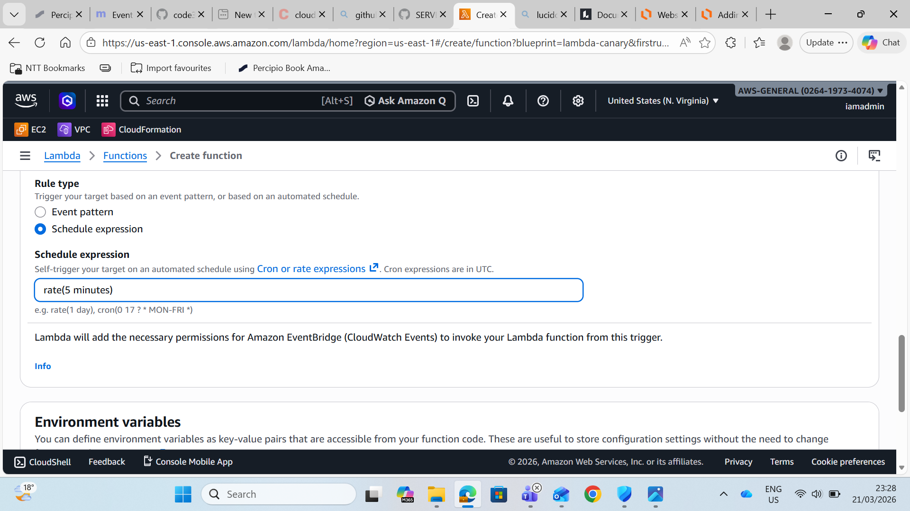

### 5. Environment Variables
Added two key variables:
- `site` = `https://cloudonaut.io/`
- `expected` = `cloudonaut` (a string that exists on the page)

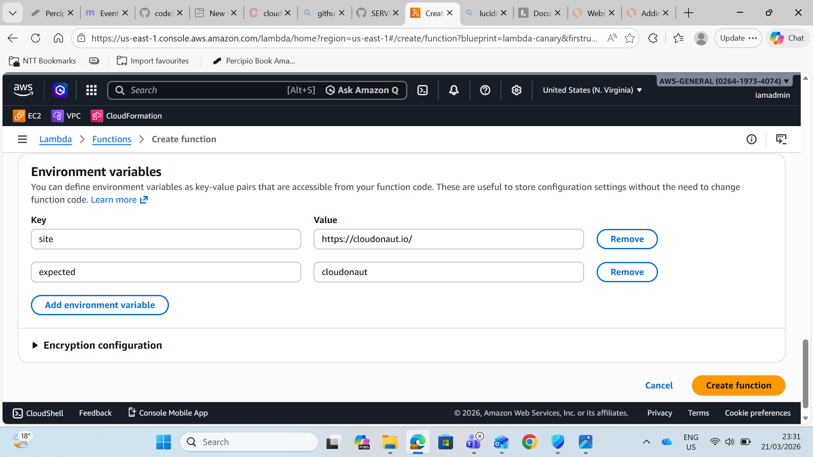

**Function created successfully** ✅

### 6–9. CloudWatch Alarm Setup
Navigated to CloudWatch → Alarms → Created a new alarm on the Lambda **Errors** metric.

- Selected the `WebsiteHealthCheck` function's **Errors** metric
- Statistic: Sum
- Period: 5 minutes
- Threshold: **Static** → Greater than **0**

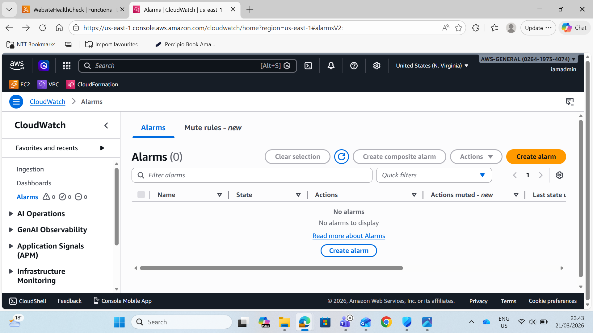
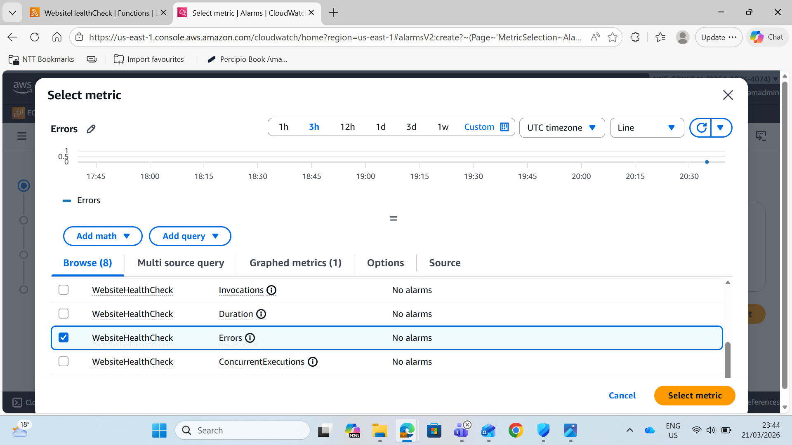
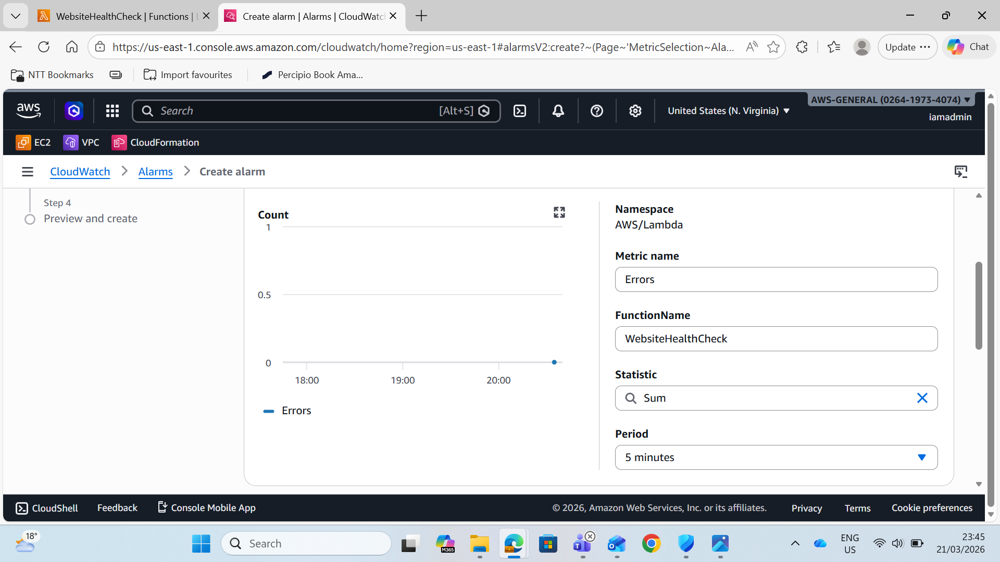
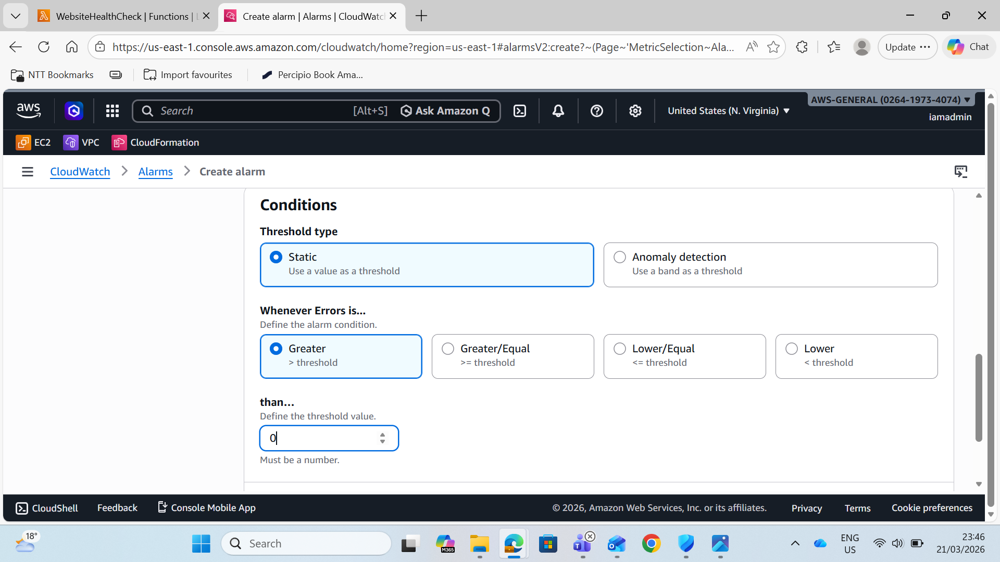

### 10–12. Alarm Actions & Notification
Configured the alarm to send notifications to a new SNS topic named `website-health-check` when the alarm state changes to **In alarm**.

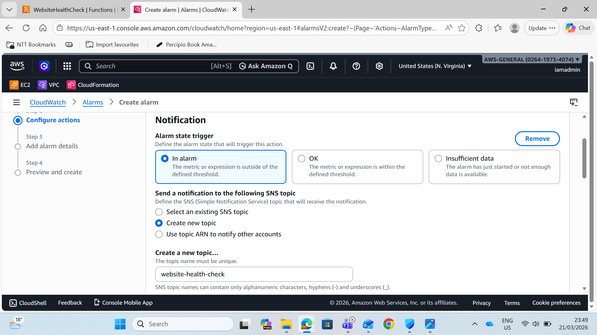
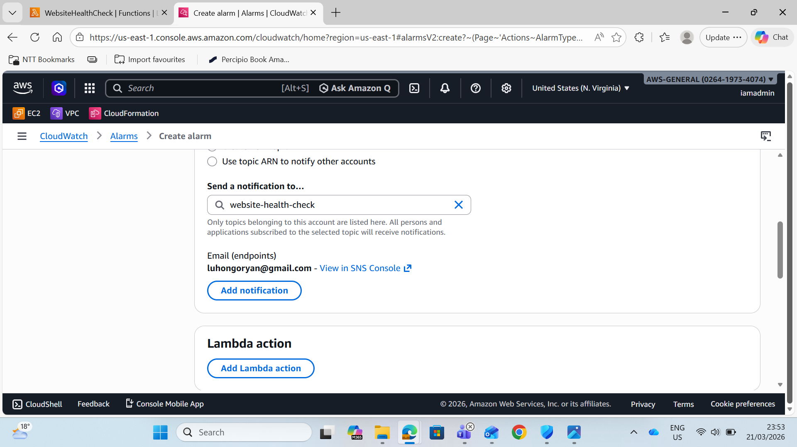
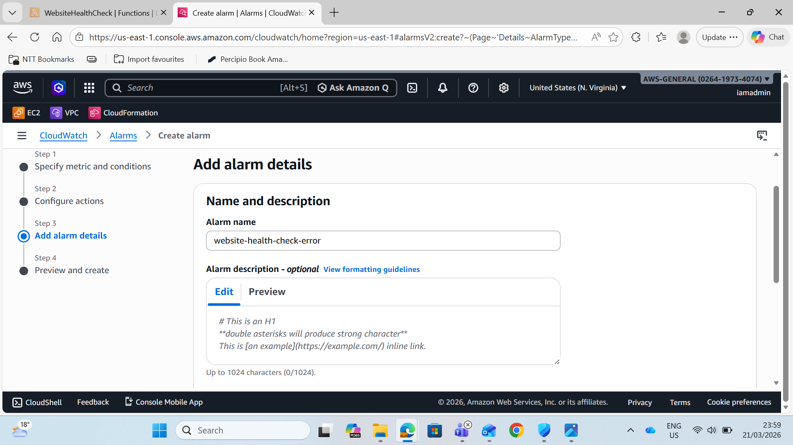

### 13. Alarm Created Successfully
The alarm `website-health-check-error` is now active and in **OK** state.

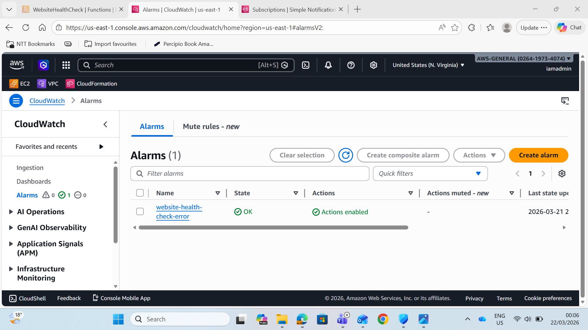

### 14. Testing the Alarm (Intentional Failure)
Updated the `expected` environment variable to `FAILURE` (a string that does **not** exist on the page).  
This forces the Lambda to error on the next run → CloudWatch metric increments → Alarm triggers.

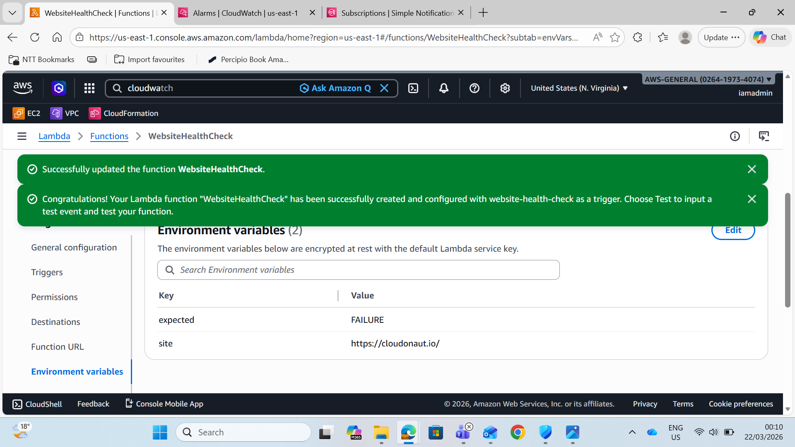

**Success banners confirm the function updated and the EventBridge trigger is active.**

### 15. Final Architecture Diagram
Visual overview of the complete flow (included above).

## How It Works (Summary)
1. EventBridge fires every 5 minutes.
2. Lambda fetches the website and checks for the expected string.
3. On failure → Lambda throws error → `Errors` metric = 1.
4. CloudWatch Alarm detects > 0 errors → SNS notification sent (email/SMS to owner).

## Demo & Testing
- Normal state: `expected = cloudonaut` → Alarm stays **OK**.
- Failure state: `expected = FAILURE` → Alarm goes to **ALARM** within minutes.
- 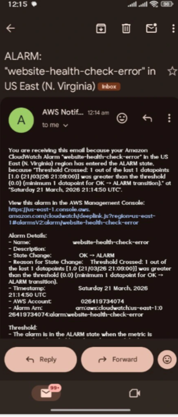 Subscribe to the SNS topic to receive real email alerts.

**Project complete!** This is a production-ready pattern for website uptime monitoring using only serverless services (no servers to manage).

